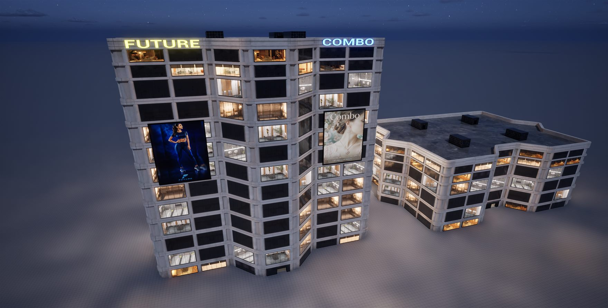
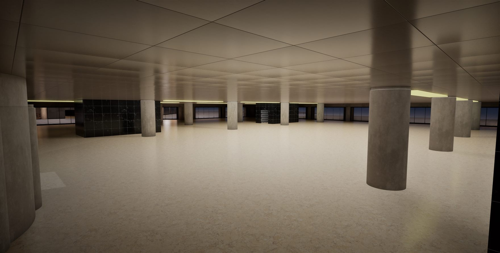
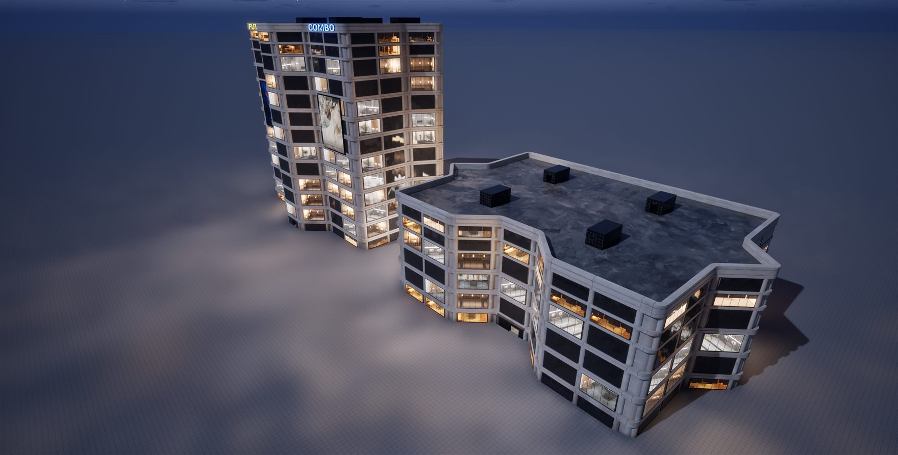

# BuildGen - procedural building generator for Houdini + Unreal Engine 5.8

**Draw the outline of a building in Unreal, give the generator a few wall blocks, and it builds the
whole thing:** walls along the contour, floor and ceiling slabs, columns, stairs, a lift shaft,
lights, storeys stacked on top of each other, a roof with a parapet and a stair housing - with
working collision. Then you bake it into a single Blueprint and walk through it.

The generator lives in Unreal as a Houdini Digital Asset; Houdini is the calculator on the other
end of a live session.

| | |
|---|---|
|  |  |

## Tutorials

- Part 1 - the generator (4 hours, for beginners and advanced users): https://youtu.be/JiVEJJDeOF0
- Part 5 - the upgraded generator, from City Sample blocks to a baked Blueprint: https://youtu.be/lHj8kQujC0w
- Full playlist: https://www.youtube.com/playlist?list=PLLvlwfuv1pNA
- On Epic Developer Community:
  - https://dev.epicgames.com/community/learning/tutorials/8KnB/free-houdini-21-0-753-unreal-engine-5-8-building-generator-for-beginners-and-advanced-users
  - https://dev.epicgames.com/community/learning/tutorials/9mXME/part-5-upgrade-building-generator-houdini-21-0-753-unreal-engine-5-8-2

## Download

- **Current version (v2, the one from Part 5):** the `BuildGen` folder of this repository, or the zip
  on the [Releases](https://github.com/AlexKorotkin-creator/BuildingGenerator/releases) page.
- **First version (v1, the one from Part 1-4):** also on the Releases page.

## Requirements

- Houdini 21.0 (Indie or commercial) with the Houdini Engine plugin for Unreal.
- Unreal Engine 5.8.
- Wall blocks: the tutorial uses Epic's free **City Sample Buildings** pack from Fab. Epic's meshes
  are not included here - the `geo` folder holds placeholder cubes so the generator runs out of the
  box. See `BuildGen/README.txt`, section "GET THE BLOCKS".

## What is inside `BuildGen`

| | |
|---|---|
| `Generator.hiplc` | the Houdini scene - the file you open |
| `hda/BuildGen.hda` | the generator itself |
| `hda/Rebuild_Blocks_From_UE*.hdalc` | tools that turn Unreal meshes into blocks |
| `My_Buildings/` | Unreal assets: the contour planner widget, the contour spline, its Python |
| `Scripts/` | helper scripts |
| `BuildGen_Parameters.html` | what every parameter does |
| `README.txt` | the full guide |

The digital assets were saved with Houdini Indie, so they open in Houdini Indie and commercial.

## How it was made

I designed the tool and tested every step in Houdini and Unreal; the code was written by
Claude Code, the AI assistant from Anthropic, under my direction.

## Licence

Free and open source under the **MIT licence** (see [LICENSE](LICENSE)). Epic's building blocks and
SideFX software are not part of it and keep their own terms; see [NOTICE.md](NOTICE.md).

Also by me: **City Generator** - real city districts in Unreal Engine 5.8 with Epic's City Sample
tools: https://github.com/AlexKorotkin-creator/CityGenerator

Alexander Korotkin · https://alexkorotkin.com · ripper120767@gmail.com
